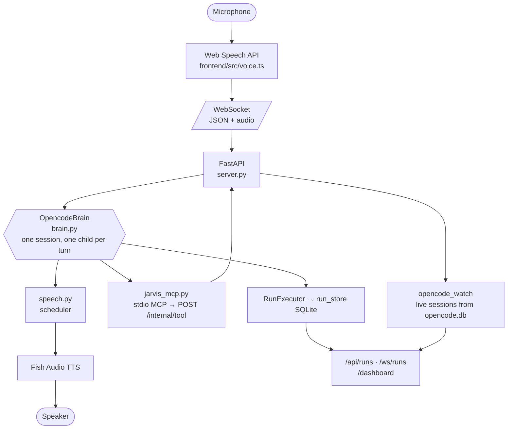

# JARVIS


[](requirements.txt)
[](project_documentation.md)
[](https://opencode.ai)
[](tests/)
[](LICENSE)

**Just A Rather Very Intelligent System — a voice for OpenCode, native on Windows.**

You talk to him. He brainstorms a project with you out loud, writes the design
down, then starts a real agent session and drives it through plan → review →
execute — every execution recorded as a *run* you can watch live. While it runs
he watches every OpenCode session on your machine, and when one is stuck
waiting on a human he tells you which one, out loud, without you having to look.

> "Will do, sir."


*What you look at while you talk to him: `frontend/src/orb.ts`, rendered
live. Regenerate with `scripts/make_orb_loop.py`.*

## Proven working

A real run, on this machine, through the real server — no mocks:

```
POST /api/runs  →  run f9ed9f00… spawned
status=running in=0 out=0 turns=0
status=running in=8920 out=174 turns=2
status=succeeded in=9180 out=185 turns=3
result_text=Creating your one-line file. DONE
hello.txt content='HELLO-JARVIS'
PROOF-PASSED
```

The file exists on disk, the database holds the full event stream
(`step_start`/`tool_use`/`text`/`step_finish`) plus usage — the dashboard
would have shown it climbing live.

## What he does

- **Brainstorms out loud.** The conversation is the design phase. He asks one
  question at a time, offers two or three approaches, and does not start
  anything until you have agreed on one.
- **Writes the design down.** What you agreed goes on disk as
  `docs/superpowers/specs/YYYY-MM-DD-<topic>-design.md` *inside the project
  being built* — before a single process is spawned.
- **Drives the build.** A build is a real `opencode run` session handed a
  brief that tells it to write a phased plan, review it against the spec,
  then execute it task by task, ticking checkboxes as it goes.
- **Watches every OpenCode session on the machine** — not just his own. Ask
  "which of my sessions are waiting on me?" and he checks live: working,
  idle, needs-you, fresh. He can post a message into one (`steer_session`),
  and press a key in a stuck console window (`answer_dialog`, return /
  escape / 1–9 only, never text).
- **Interrupts you when it matters.** A session that needs a human gets said
  out loud immediately; a finished one is batched into one sentence at the
  next pause. With no browser tab open, it becomes a Windows toast instead.
- **Remembers.** Long-term memory is a folder of plain Markdown files, one
  fact per file. Read and edit it in any text editor.
- **Records everything.** Every agent process JARVIS starts is a *run*: a
  SQLite row with prompt, project, status, tokens and the full event
  stream. Watch them live at `/dashboard`.


*The whole dashboard, clicked through. Fictional sample data throughout.*

## Requirements

- **Windows 10/11.** Terminal, window list, screenshots, toasts and keypresses
  go through PowerShell + Win32 (`ctypes`, no new dependencies). No
  AppleScript, no `screencapture`, nothing macOS remains.
- **Chrome or Edge.** The microphone uses the Web Speech API
  (`SpeechRecognition`), which Firefox has never implemented.
- **OpenCode 1.18.32+**, signed in (`opencode auth login`). JARVIS's brain and
  every run are `opencode run` children on your providers — no Anthropic API
  key, no subscription login dance.
- **Python 3.10+** and **Node.js 18+**.
- **A Fish Audio API key.** Required; there is no fallback voice.

## Quick start

```powershell
git clone https://github.com/Nishant1600/BrainstormingJARVIS jarvis
cd jarvis

Copy-Item .env.example .env   # then fill in FISH_API_KEY

pip install -r requirements.txt
python -m playwright install chromium    # for read_page / look_at_page

cd frontend; npm install; cd ..
```

**`.env`** — one required key, the rest optional (see `.env.example`):

```env
FISH_API_KEY=...                              # required, no fallback
JARVIS_RUN_MODEL=opencode/muse-spark-1.3-contributor-free
# JARVIS_BRAIN_MODEL=...                      # provider/model for the brain
# JARVIS_OPENCODE_PATH=...                    # default: opencode on PATH
# USER_NAME=Tony
```

**Certificates** (required — the Vite proxy targets `https://localhost:8340`,
so a plain-HTTP backend loads the page while every `/api` call 500s):

```powershell
openssl req -x509 -newkey rsa:2048 -keyout key.pem -out cert.pem `
  -days 365 -nodes -subj "/CN=localhost"
# Git for Windows provides openssl; otherwise use mkcert
```

**Run it** (two terminals):

```powershell
python server.py --host 127.0.0.1        # terminal 1
cd frontend; npm run dev                 # terminal 2
```

Open **Chrome/Edge** at `http://localhost:5173`, click once for audio, speak.
Dashboard: `http://localhost:5173/dashboard.html`.

> **Who can reach it.** `--host` defaults to `127.0.0.1` — this machine only.
> A strict `Origin` check guards every WebSocket and state-changing route, and
> the MCP child bears a bearer token from `<data>/jarvis/tool-token`. See
> [What this trusts, and why](#what-this-trusts-and-why).

Mic tip: Chrome scopes the grant to origin *including the port* — if Vite
restarts on 5174, re-allow the mic there.

## How it works



The brain is **one conversation**, not a request per turn: the session persists
server-side in opencode's database, so every turn is a short-lived
`opencode run --session <sid> --continue` child against it. A stuck turn costs
a kill and a retry, never the conversation. First turns carry the launch
context; `CLAUDE.md` in the brain home loads as standing instructions; usage
is translated per step so context budgets and rotation work unchanged.

Every agent execution — brain or run — goes through one recorded pipeline
(`run_executor.py` + `run_store.py`): **a run always reaches a terminal
state** (`succeeded`/`failed`/`timed_out`/`cancelled`), and **every state
transition is a DB write before it is a notification**.

## Configuration

| Key | Default | Notes |
|---|---|---|
| `FISH_API_KEY` | — | **Required.** Fish Audio TTS |
| `JARVIS_RUN_MODEL` | — | `provider/model` for runs (fail-fast if unset) |
| `JARVIS_BRAIN_MODEL` | — | `provider/model` for the brain |
| `JARVIS_OPENCODE_PATH` | `opencode` on PATH | Agent binary |
| `JARVIS_BRAIN_AUTOSTART` | `1` | `0` builds the brain without spawning (tests use this) |
| `JARVIS_SKIP_PERMISSIONS` | `true` | Maps to opencode `--auto` (unattended runs can't answer prompts) |
| `JARVIS_RUN_TIMEOUT_SEC` / `JARVIS_RUN_IDLE_SEC` | 6 h / 30 min | Capped at 24 h; no way to ask for unbounded |
| `JARVIS_DATA_DIR` | `data/` | SQLite, memory Markdown, tool token — isolate instances here |
| `JARVIS_ALLOWED_ORIGINS` | — | Extra origins for LAN/tunnel use |
| `FISH_VOICE_ID` / `USER_NAME` | JARVIS voice / `sir` | Voice and address |
| `WEATHER_*` | auto-IP / °F | Location override + units |

Provider credentials pass straight through to opencode (`auth.json` +
environment) — there is deliberately no scrubbing and no billing switch.

## Connections: bring your own

JARVIS ships connected to nothing. Declare MCP servers in
`data/jarvis/connections.json` (`mcpServers` block, `command`+`args`/`env`
or `url`); the server validates, translates into the brain home's
`opencode.json`, and reports what connected and what would not start when
you ask **"what are you connected to?"**. Results from your own servers are
treated like the open web — reported, never obeyed.

## Project structure

| Path | Role |
|---|---|
| `server.py` | FastAPI + voice loop + REST + staged steers/dialogs |
| `brain.py` | `OpencodeBrain`: session-per-turn voice brain |
| `run_executor.py` / `run_store.py` | Recorded run pipeline + SQLite |
| `opencode_parser.py` / `opencode_env.py` | `--format json` parsing · child environment |
| `opencode_watch.py` / `opencode_steer.py` | Live sessions from `opencode.db` · steer via continue-turns |
| `jarvis_mcp.py` | stdio MCP → `POST /internal/tool` |
| `actions.py` / `dialog.py` / `screen.py` / `notifier.py` | Windows: terminal/browser/editor · guarded keypress · screenshot + windows · toast |
| `preflight.py` | Startup environment checks (observe-only, never raise) |
| `speech.py` / `tts.py` | Utterance scheduler · Fish Audio |
| `builds.py` / `specs.py` / `projects_view.py` | Phased builds · review surface · Projects tab |
| `jarvis_memory.py` / `frontend/` | Markdown memory · Vite + Three.js orb + dashboard |

Deeper docs: `Architecture.md` (design) · `Plan.md` (work plan) ·
`Phase.md` (phases) · `project_documentation.md` (manual).

## Testing

```powershell
pytest                    # whole suite except live-browser (no network/screen)
pytest -m browser         # live Playwright tests (self-skip offline)
```

Conventions the suite enforces: no `innerHTML` on the dashboard, no silent
run states, byte-exact template hashes, static safety sweeps over every
function that prints somebody else's words.

## Troubleshooting

| Symptom | Fix |
|---|---|
| UI loads, every `/api` call 500s | Generate `cert.pem`/`key.pem` beside `server.py`, restart backend |
| `402 Insufficient account funds` | That provider/model is out of credit — switch `JARVIS_RUN_MODEL` to a funded one |
| `answer_dialog` → `not_found` | Session lives in a tabbed terminal/IDE — move it to a standalone console window |
| Steer finds nothing | Sessions older than ~15 min of quiet aren't listed as live; prompt it first |
| Mic hears nothing | Chrome/Edge only; allow the mic; check the port didn't move to 5174 |

## What this trusts, and why

1. **The web boundary**: same-origin `Origin` + `Host` checks, no CORS, bearer token for the tool channel.
2. **Taint**: anything read off this machine or the web is information, never instructions — tainted turns can't act unsupervised.
3. **Keypress safety**: closed vocabulary (return/escape/1–9), console-attachment identity (never focus-guessing), nothing raised.
4. **Screen privacy**: captures only on your turn, deleted in milliseconds, blank frames refused rather than described.
5. **Run integrity**: terminal states always; DB writes before notifications.

## Port status

Ported from a macOS + Claude Code original to **Windows + OpenCode** with
functioning preserved; the macOS halves were removed, not branched. The
Claude agent runtime (`claude_env`, `stream_parser`, `session_steer`,
`Brain`-claude) is currently being deleted file by file —
`tests/test_run_executor.py` is the known-red straggler mid-port. Everything
else in the suite is green.

## License

MIT — see [LICENSE](LICENSE). Originally Claude-Code-based work by its
authors; Windows + OpenCode port maintained here.
